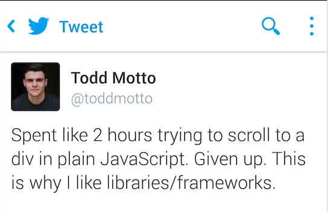

# Chapter 2: No framework, no panic

## A bit of history: evolution of JavaScript scene

### Vanilla JavaScript

In the beginning, there was just JavaScript and almost everyone was afraid to use it because of the inconsistent DOM APIs across different browsers which resulted in lots of bugs.

### jQuery

jQuery came along and it was a great step forward, making DOM manipulation and AJAX calls less risky by abstracting away the differences into one consistent API. 

As developers began to write more and more JavaScript and jQuery to make their applications more innovative their code quickly became messier and difficult to manage.

### 1st generation of MV* frameworks: Backbone, Knockout...

Backbone arrived and provided organization to that messy jQuery code and allowed a new generation of applications to be built in the browser by adding a thin layer on top of the familiar jQuery code developers were already writing.  

Developers still found it difficult to be productive and longed for features such as data binding, for which then Knockout came along providing it but didn’t actually have any other features that developers needed to build single page applications (SPA).

These lack of features was partially solved by the appearance of libraries such as Underscore or Lodash.

### 2nd generation of MV* frameworks: Angular, Ember...

At this point a second generation of more robust frameworks began to come out.  Angular emerged with all the needed framework pieces in one box: data binding, routing, templating, persistence as well as a compelling testing story and a more declarative syntax. 

### 3rd generation of MV* frameworks: React, Angular2

Though the 2nd generation was adopted by many developers in their projects and are still really popular nowadays, they presented some quite notorious performance problems and some other like having a quite steep learning curve which are the areas that the current modern generation of MV* frameworks try to tackle allowing the creation of applications following the new paradigm the web development scene is moving to, the web components.

## Frameworks vs JavaScript



### Why to use a framework?

* Cross-browser compatibility
* Code simplification (e.g.: AJAX calls, DOM manipulation...)
* Avoid reinventing the wheel
* Security features

### Why you should still learn JavaScript first?

* Every framework uses JavaScript under the hood --> Good to have an idea of what you're actually doing ;)
* Better for small libraries/components:
  * Portable (easier to adapt to any other application)
  * Saves bandwidth

## Libraries

### jQuery [API](http://api.jquery.com/)

* Adds a $ object to the global scope with a bunch of methonds in it

#### Code examples:

**Select a DOM element**

jQuery:
```javascript
$('#myElement'); 
```
JavaScript:
```javascript
document.getElementById(“myElement”);
```

**Show an alert after clicking a button**

JavaScript:
```javascript
document.getElementById(“myButton”)
   .addEventListener(‘click’, function() { 
      alert(“Hello”); 
   });
```
jQuery:
```javascript
$(‘#myButton”).click(function() { 
   alert(“Hello”); 
}); 
```

**Change the background color of a div**

JavaScript:
```javascript
function changeBackground (color) {
        document.body.style.background = color;
}
<div class=“greenDiv” onload=”changeBackground (‘green’);”>
```
jQuery:
```javascript
$('.greenDiv').css('background', 'green');
```

### Underscore [API](http://underscorejs.org/)

Underscore.js is a JavaScript library which provides utility functions for common programming tasks.

Nowadays though, with the appearance of ES5 and ES6 most of their utilities can be replaced by plain JavaScript.

**Filter even numbers of an array**
[Play it](https://jsfiddle.net/_dami_/53xdLjxq/)

JavaScript < ES5:
```javascript
...
for (var i = 0, length = array.length; i < length; i++) {
   if (array[i] % 2 === 0) {
      evenNumbers.push(array[i]);
   }
}
```
Underscore:
```javascript
_.filter(array, function(num){ return num % 2 === 0; });
```
JavaScript > ES5:
```javascript
array.filter(function(num){ return num % 2 === 0; });
```
**Exercise time!**

use jsfiddle or local dev environment, use underscore and ES6 API (hint: www.devdocs.io all JS apis in a SPA)
- solve it in underscore and in ES6
- Get the Maximum Number of the array

  [1,2,3,4,5,6]
=> 6
- get the keys of a object
```javascript
{ruben: 31, thomas: 32, sophie: 30 }
=> ["ruben", "thomas", "sophie"]
```


**Difference between two arrays**
[Play it](https://jsfiddle.net/_dami_/x9j4g234/)

JavaScript:
```javascript
function calculateDiff (first, second) {
    var diff = [];
    if (!Array.isArray(first) || !Array.isArray(second)) {
        return diff;
    }

    for (var key, i = 0, length = first.length; i < length; i++) {
      key = first[i];
      if (second.indexOf(key) === -1) {
        diff.push(key);
      }
    }
    return diff;
}
```
Underscore:
```javascript
_.difference(firstArray, secondArray);
```

## MV* frameworks

### AngularJS [API](https://docs.angularjs.org/api)

**Hello world**

AngularJS:
[Play it](https://jsfiddle.net/_dami_/oucgd4se/)
```html
<body ng-app>
  <div>
     <label for="myInput">Name: </label>
    <input type="text" id="myInput" placeholder="Please enter your name" data-ng-model="name" />
    <h1 id="myLabel">Hello {{name}}</h1>
  </div>
</body>
```

jQuery:
[Play it](https://jsfiddle.net/_dami_/Lnhdknfr/)
```javascript
$(function () {  
	$(document).keyup(function () {  
  	var name = $("#myInput").val();  
    $("#myLabel").html(name);  
  });  
}); 
```

## Further reading

* [Getting cozy with UnderscoreJS](http://code.tutsplus.com/tutorials/getting-cozy-with-underscorejs--net-24581)

## Homework
* add underscore to your project
* add "created at" as a new field to the todo list.
* add "author" as a new field to the todo list.
* add dropdown to select the sort method
  * use underscore to sort the todo-list with index of createdAt / author. 
  * use ES6 to sort the todo-list with index of createdAt / author.
* add dropdown to select the render method
  * (todo-name -> "test todo"), (todo-name, author -> "test todo, Thomas Meyer"), (todo-name, author, created -> "test todo, Thomas Meyer, 22.3.1901")
  * on every value change of the dropdown with the render method, the todo list will be rerendered with the given method.
  * use underscore for it and implement it also with ES6
* Outcome: 
  * you should learn the api features of underscore and ES6
  * how to use and develop with an api. Get known of the features. 
  * Implement every short algorithm in a function, one version in ES6 one in underscore. like ("function sortByNameES6()" and "function sortByNameUS()"

